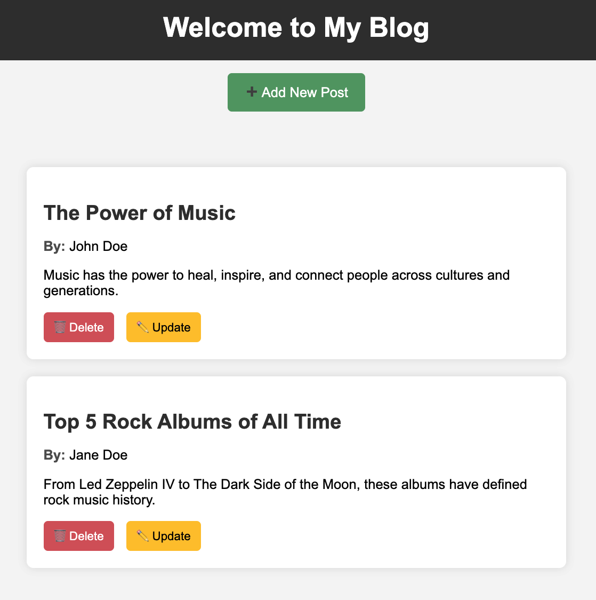

#  Flask Blog Application (Masterblog)

A simple blog application built using **Flask**, allowing users to **create, update, delete, and view** blog posts. Posts are stored in a **JSON file** instead of a database.

This is a project created as part of the Masterschool curriculum.

---

## Features
✅ View all blog posts  
✅ Add new blog posts  
✅ Edit existing blog posts  
✅ Delete blog posts  
✅ Responsive and clean UI  

---

## 🛠️ Installation & Setup

### 1. **Clone the repository**
```sh
git clone https://github.com/YOUR_GITHUB_USERNAME/YOUR_REPOSITORY_NAME.git
cd YOUR_REPOSITORY_NAME
```

### 2. **Create a virtual environment (Optional but recommended)**
```sh
python -m venv venv
source venv/bin/activate  # On Mac/Linux
venv\Scripts\activate     # On Windows
```

### 3. **Install dependencies**
```sh
pip install -r requirements.txt
```

### 4. **Run the Flask app**
```sh
python app.py
```

### 5. **Access the app in your browser**
Open `http://127.0.0.1:5001/`

---

## 📁 Project Structure
```
/flask_blog_project
│── /static
│   └── style.css          # Styling for the blog UI
│── /templates
│   ├── index.html         # Home page displaying all blog posts
│   ├── add.html           # Form to create a new blog post
│   ├── update.html        # Form to update an existing blog post
│── app.py                 # Main Flask application
│── data.json              # JSON file storing blog posts
│── requirements.txt       # Dependencies for the project
│── README.md              # Project documentation
```

---

## 🔥 Usage Guide
- **Adding a post**: Click **"Add New Post"** and fill out the form.
- **Editing a post**: Click **"✏️ Update"**, modify the content, and save.
- **Deleting a post**: Click **"🗑 Delete"** to remove a post permanently.

---

## 🛠️ Technologies Used
- **Flask** (Backend)
- **HTML/CSS** (Frontend)
- **JSON** (Data storage)

---

## 📝 License
This project is **free to use** and open-source. Feel free to contribute!  

---

## 🙏 Acknowledgments

Special thanks to Masterschool for providing the guidance and resources for this project.

---



🚀 **Enjoy blogging with Flask!** 📝✨
